# MSQ's architecture

## 1 Big picture

MSQ is a MetaMask Snap and a dapp hosted on the Internet Computer. The dapp is a continuation of the snap - it extends the UI of the snap, allowing easier access to various functionalities for end-users, such as managing their ICRC-1 tokens (assets) or identities (masks).

MSQ is designed to be integrated into other web-services. For these web-services, MSQ provides a number of functionalities, such as authorization and payments. In order to utilize these functionalities, web-services use a client library, provided by us. This library encapsulates complex interactions between peers, representing the functionalities as easy-to-use APIs.

Users who interact with web-services integrated with MSQ are able to authorize within these web-services using identities, derived from their MetaMask seed phrase. For as long as they possess this seed phrase, they are able to recover access to any of previously derived identities. The user is able to sign arbitrary messages coming from a web-service using these identities, which allows them to interact with the Internet Computer canisters. 

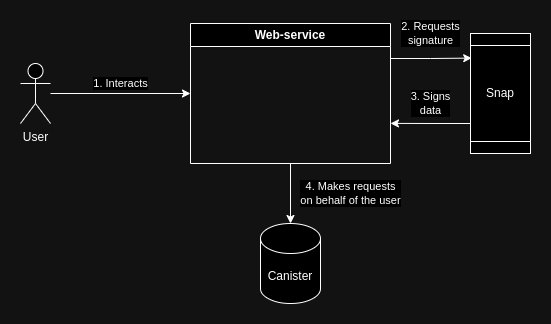

Besides authorization, users are able to pay for goods and services within a web-service with their MSQ-managed assets.

## 2 Security principles

MSQ's top priorities are user's privacy and security - we want our users to stay as safe and anonymous as possible, while allowing a certain level of flexibility on-demand. This forces us to follow strict security policies, which guide the design of this software.

In general these principles follow and extend MetaMask's offical [security guidelines](https://docs.metamask.io/snaps/concepts/security-guidelines/).

### 2.1 MSQ team knows nothing

We know as little about our users' cryptographic material and personal data as any other entity in the world. We don't backup user derived entropy. We don't gather any personalized statistics (only if anonymous). We don't track what users do in our dapp's frontend using Google Analytics or any other tool like that.

### 2.2 Cryptographic material never leaves the Snap

We do not allow any web-service (including MSQ's own dapp) to read any sensitive cryptographic material from the Snap. In fact, we don't even store the derived entropy in the Snap - we deterministically generate it on-the-fly each time the user needs it, do the calculations and then immediately dispose it, only returning the artifacts of these calculations (e.g. cryptographic signatures). We do allow reading public parts of some of these material to web-services, but in such a way it can't do any harm.

### 2.3 MSQ is deterministic

MSQ is a Snap, it has no cloud storage, so all the data is self-managed by the user. It is safe for users to lose their data (by re-installing the snap, for example) - because they can recover it from their seed phrase later. To achieve that we use deterministic algorithms for entropy derivation.

### 2.4 Privacy-first

In contrast to MetaMask, MSQ adopts identity scoping technique - the user derives **different** identities for each website, while using MSQ. In MetaMask the user has a number of identities (accounts) and these identities are global - every web-service can interact with each of these accounts. The user may forbid such an interaction, but the possibility is there.

In MSQ a web-service has its own separate set of user identities it can interact with, with no ability to interact with user's identities from other web-services. This not only helps with the privacy, since web-services can't track users anymore, but it also solves the scam website issue - when a malicious website, which mimics the appearance of some other well-credited website, steals a signature from a user. In our setting, such a website won't be able to acquire a signature, since the underlying key-pair for each identity is different.

MSQ users are able to create an arbitrary number of identities for each web-service they interact with. 

#### Example

For example, when a user logs in to website `https://example-1.com`, they will be provided with the following identities:

* `tky3b-ldadc-oe6gj-va2k3-zgrnd-4nbhn-xzmtu-iemu7-g5wrl-z6d2k-sae`
* `owxvk-bykxm-qwm3u-6bqgh-jvqo6-pvpee-tc2v6-47f6s-vngrr-rhqvc-dae`
* ...

And when a user logs in to website `https://example-2.com`, they will be provided with these identites:

* `363n3-d5gyd-s7lql-lltjf-6nudo-aqhcx-ykre3-pdfkc-ksg7r-bpdlm-uqe`
* `adiyk-dtbej-tcnke-kp76f-qm7as-wdqjx-xusjf-c4puf-vxsmt-bx3v3-nqe`
* ...

These identities have different public parts and compute different signatures on the same message, which represent different public key.

> Such a design decision is a major trade-off between user's security and a website's integration capabilities. Since two websites are no longer able to determine if they both interact with the same user, they can't integrate with each other to provide better services. We acknowledge this problem and work on a compatible solution.
>
> We already provide a solution for a special case of this issue - domain migration. For example, when a project was known by one name (`https://cool-project.com`), but then re-discovered their brand and changed the domain name (`https://very-cool-project.com`). The solution for this situation is called **Mask Linking**, and it allows your new domain to offer users access to their identities from your old domain. More on that in section 4.5.

These identities can be used to "log in" to a web-service. But it is also possible to log out from any web-service using MSQ's dapp. Such a function, together with cache clean up enables users to log into a web-service with a completely clean session, improving privacy even further.

In addition to identity scoping for authorization, MSQ also adopts identity scoping for payments. A user is able to create an arbitrary number of accounts for each [ICRC-1](https://github.com/dfinity/ICRC-1/blob/main/standards/ICRC-1/README.md) token they manage with MSQ and all of these accounts will have different identities. This makes it harder to track user's expenses from the outside. These payment identities are hidden from any other web-service except for the MSQ dapp. A web-service will only know such an identity if a user makes a payment to it using this identity.

## 3 Component overview

MSQ consists of 4 main modules:

* **Snap module** (/packages/snap) - a typescript module that implements the logic of the snap itself;
* **Dapp frontend** (/apps/site/src/frontend) - a typescript solid-js web application, an IC-deployed asset canister, that interacts with the Snap and handles token management;
* **Anonymous statistics backend** (/apps/site/src/backend) - an IC-deployed Rust canister, that stores anonymized statistics of MSQ usage;
* **Client library** (/packages/client) - a typescript library that allows other web-services to integrate with MSQ.

### 3.1 Snap module

The Snap module provides a user with two main functionalities:

1. Provide the user with deterministically generated key pairs for various scenarios.
2. Manage user data and persist it between sessions.

Users interact with the Snap by sending it various JSON-RPC requests as specified in [MetaMask Snaps Documentation](https://docs.metamask.io/snaps/reference/rpc-api/). It is only possible to perform such requests via a website, integrated with MSQ. The Snap authenticates incoming JSON-RPC requests by the origin of the website, which is used to send them.

The Snap module consists of three components (orchestrated by the snap itself), which in general interact with each other the following way:

#### 3.1.1 Protected Methods Guard

MSQ's Snap allows MSQ's Dapp frontend (section 3.2) to execute additional methods. These additional methods are considered sensitive by our security policy, so they are not allowed for execution by other websites. Protected methods guard makes sure no website, besides the Dapp frontend, can invoke these methods.

#### 3.1.2 State Manager

Snaps are allowed to persist up to 100MB of state inside the browser extension. This persisted data is automatically encrypted. It is only possible to read the whole state and to write it all at once - no partial reads/writes are allowed. MSQ does these operations very frequently. This creates a performance issue, when the state reaches megabytes in size - the encryption algorithm is too slow for real time usage.

The State manager optimizes this part, by passively observing the state (using [Proxy](https://developer.mozilla.org/en-US/docs/Web/JavaScript/Reference/Global_Objects/Proxy)) only persisting it when it was actually updated.

Another responsibility of the State manager is to encapsulate internal complexities of various data-related operations into a nice API.

#### 3.1.3 Controller

The Controller's responsibility is to parse the incoming JSON-RPC message, validate it (we use [zod](https://zod.dev/)) and execute the business-logic methods responsible for handling the message.

The business logic is considered a part of the Controller and is divided into four categories (protocols):

* **icrc1** - methods related to assets management;
* **identity** - methods related to identity management and authorization;
* **state** - methods related to general state management;
* **statistics** - methods related to anonymized statistics management.

### 3.2 Dapp frontend

MSQ's Snap provides different functionalities for the MSQ's Dapp frontend and for other websites - Dapp frontend is trusted more than other websites, so it is allowed to do more dangerous actions with user's data stored on the Snap.

This trust assumption comes from the IC's security guarantees. Dapp frontend is deployed to the IC as so-called [asset canister](https://internetcomputer.org/docs/current/references/asset-canister), which [certifies](https://internetcomputer.org/docs/current/references/ic-interface-spec/#certification) all the files stored in it, making it impossible to tamper with this data. This means, that it is very hard for an attacker to alter the code of the Dapp frontend module and therefore do any harm to users' data. The canister implements a number of CSP rules, which are described [here](/apps/site/public/.ic-assets.json5).

Dapp frontend's main functionality is to extend the functionalities of the Snap, by providing better UIs for them.

So, Dapp frontend exchanges messages with the Snap, but it can also exchange messages with other websites via [postMessage](https://developer.mozilla.org/en-US/docs/Web/API/Window/postMessage) API. These websites use the Client library (section 3.4) that encapsulates the underlying protocol.

Dapp frontend can be used in standalone mode (not in the context of integration) available at [https://msq.tech](https://msq.tech). This allows users to manage their assets and identities as well as provides a well-known entry point.

No automation is allowed on Dapp frontend - all events are checked with `.isTrusted()` and rejected otherwise. 

### 3.3 Anonymous statistics backend

Both: the Snap and the Dapp frontend gather anonymous usage statistics in background. This statistics consists of the following metrics:

* total number of created identities;
* total number of produced signatures;
* total number of created asset accounts;
* total number of transferred assets per each asset.

This data is not annotated with any id or tracking number - it is just sent "as is" to a special canister, that adds these numbers to it's global counters. So it is impossible to understand, for example, how many ICPs a particular user has transferred, when these transfers occured or to whom they were made. The sending to the canister is performed via an anonymous identity (without a signature) once a day or less frequently.

### 3.4 Client library

MSQ is designed to be integrated into other web-services. To simplify the integration process, we offer developers a client library with clear and simple APIs.

Different functionalities require different intraction methods between a web-service and MSQ.

Sometimes a functionality may be utilized by sending a simple JSON-RPC call straight to the Snap (for example, when checking for the existing authorization session).

But some functionalities (as the authorization flow, for example) require the user to perform actions on the Dapp frontend. In this scenario interactions between the Dapp frontend and the web-service are performed via the [postMessage](https://developer.mozilla.org/en-US/docs/Web/API/Window/postMessage) browser API. These browser-based interactions follow [ICRC-35 standard](https://github.com/dfinity/wg-identity-authentication/blob/main/topics/icrc_35_webpage_apis.md).

Additionally to that, the library provides a `MasqueradeIdentity` primitive, which greatly simplifies MSQ's integration into existing dapps built on top of `@dfinity/*` JS libraries. This primitive implements the `Identity` interface from `@dfinity/identity` and can be supplied into any other primitive that expects an argument of this type, such as `HttpAgent` from `@dfinity/agent`.

> One interesting feature of MSQ is that it allows each website to interact with an unbound number of user's key pairs. The message signing method accepts not only the message that should be signed, but also a salt that is used for key pair derivation. All of these key pairs are scoped by websites origin. 

## 4 Flow decomposition

> **Please note**
> While texts operate with example domain names like `https://example-1.com`, MSQ Snap MetaMask pop-ups screenshots used as illustrations for the following flows are taken from websites with completely different domain names, so they might seem little inconsistent with what they illustrate.

### 4.1 Authorization

Authorization is the core functionality of MSQ. It offers both: simple UI and great privacy. But it is also a complex one - it touches every component of MSQ.

#### 4.1.1 User story

##### Prerequisites

1. The user has MetaMask browser extension installed.
2. The user has opened a browser tab with the website `https://example-1.com`, which is integrated with MSQ.
3. The user is not authorized within `https://example-1.com`.
4. `https://example-1.com` did execute `MasqueradeClient.create()` function, which connects to the MetaMask and installs the MSQ snap if needed.

##### Flow

1. The user sees a `Log in with MetaMask` button at `https://example-1.com` and clicks on it.

2. Another browser tab is opened, it is `https://msq.tech` (Dapp frontend).
3. In this new browser tab the user sees a login screen, which offers them one of the existing identities to use for the to-be-started session.

4. The user selects one of the proposed identities, by clicking on it, and the login screen tab is immediately closed.
5. The user is back at `https://example-1.com`, but now instead of the `Log in with MetaMask` button they see their avatar and pseudonym from MSQ, which indicates that the authorization was successful.

6. `https://example-1.com` now provides more functionalities to the user, because now it can send canister requests on behalf of this user's selected identity.

#### 4.1.2 Sequence Diagram

### 4.2 ICRC-1 Payment

This flow is also very important as it drastically simplifies the process of paying for goods and services on the IC. And it is even more complex, since it also makes requests to token canisters.

#### 4.2.1 User Story

##### Prerequisites

1. The user has MetaMask browser extension installed.
2. The user has opened a browser tab with the website `https://example-1.com`, which is integrated with MSQ.
3. `https://example-1.com` did execute `MasqueradeClient.create()` function, which connects to the MetaMask and installs the MSQ snap if needed.
4. Completion of user story 4.1 is optional.

##### Flow

1. The user is about to pay for goods or/and services at `https://example-1.com`.

2. They click on `Pay` button and a new browser tab is opened. It is `https://msq.tech`.
3. In this new browser tab the user sees a screen that proposes to select an account to perform the payment from.
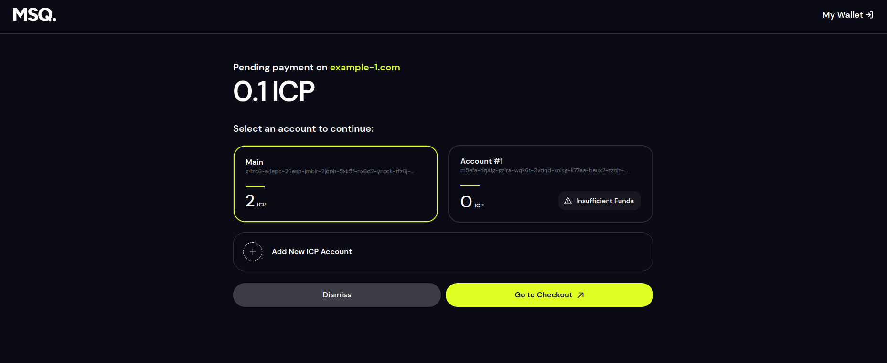
4. The user selects an account with enough funds to fulfill the payment, by clicking on it, and then clicks on `Go to Checkout` button.
5. Now this browser tab shows another screen, that lists parameters of to-be-executed payment transaction, according to ICRC-1 standard.

6. The user checks the parameters and if everything is good, clicks on `Continue` button.
7. A MetaMask pop-up opens up, once again proposing the user to double-check the parameters and warning about possible consequences.
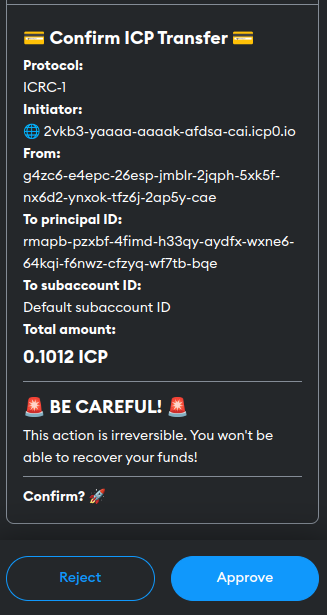
8. The user double-checks the parameters and, if everything is good, clicks on `Approve` button.
9. The pop-up closes, and the user sees a running spinner that indicates that something is happening in the background.
10. After several seconds, the user sees another screen that says that the payment went successfully.

11. The user clicks on `Go Back` button and the browser tab is closed.
12. The user is back at `https://example-1.com`. They see that their payment was received on the other side, and their order has transited to the next stage.

#### 4.2.2 Sequence Diagram

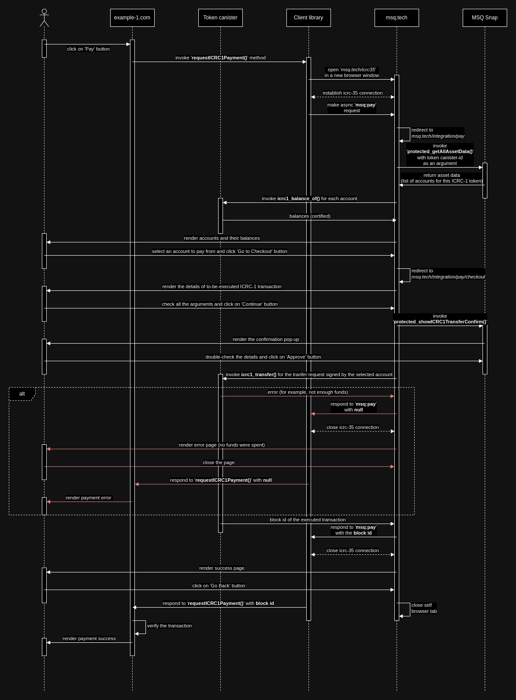

### 4.3 Anonymous authorization

This flow allows MSQ users to log in to other websites absolutely anonymously, without the website being able to track them and realize they were already a user of this website. It is very similar to flow 4.1, so we will omit some repetitions.

#### 4.3.1 User Story

##### Prerequisites

1. The user has already completed the flow 4.1.
2. The user has a browser tab with `https://msq.tech/cabinet/my-sessions` (Active Sessions section) open and active.

##### Flow

1. The user sees the Active Sessions screen at `https://msq.tech`. There is an active session at `https://example-1.com` that is left from previous authorization.

2. The user terminates the session, by clicking on `Power Off` button. A `Log out pop up` from MetaMask appears.
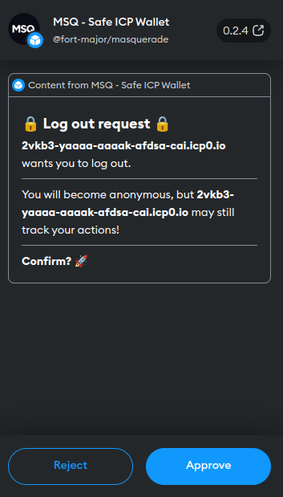
3. The user clicks on `Approve` button, the session is no longer listed in the list of active sessions.
4. The user doesn't trust `https://example-1.com`, so they want to be sure they are not tracked. In order to do that, they clear their browser cache, to remove anything (cookies, session data) `https://example-1.com` may've stored in their browser.
5. After cache clean-up, the user opens a new browser tab at `https://example-1.com` and sees a `Login with MetaMask` button.

6. The user clicks on this button and gets a new browser window is opened. It is `https://msq.tech`.

7. In order to authorize anonymously, the user creates another identity (mask), by clicking on `Add New Mask` button. A MetaMask pop-up with mask creation confirmation appears.

8. The user clicks on `Approve` button and a new identity appears in the list of available identities.
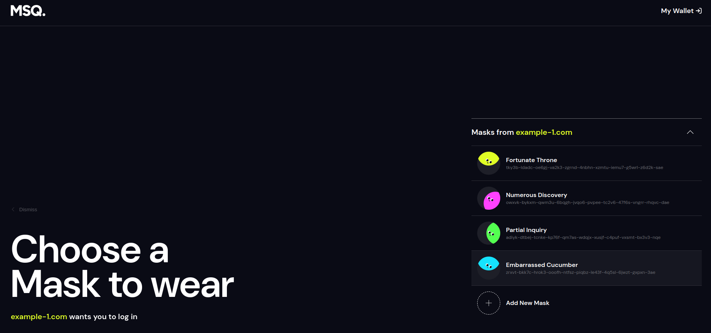
9. The user clicks on this new identity and the tab with `https://msq.tech` closes.
10. The user is back at `https://example-1.com` and sees themself authorized with the new identity.

#### 4.3.2 Sequence Diagram

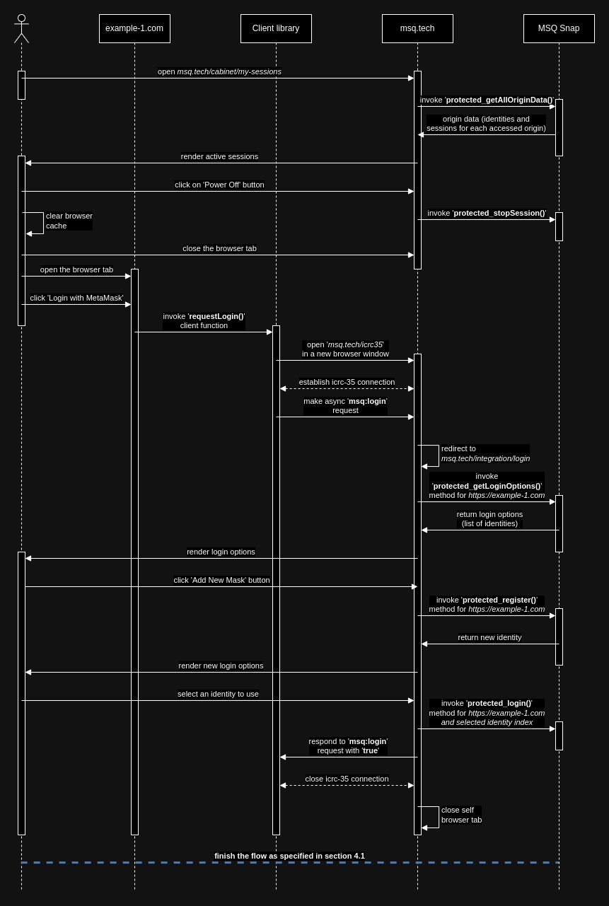

### 4.4 Canister interaction

This flow is what the authorization flow (4.1) enables the website to do. A user, once authorized, is able to sign canister requests with a key pair corresponding to their identity.

#### 4.4.1 User Story

##### Prerequisites

1. The user has completed flow 4.1.
2. The user has opened a browser tab with `https://example-1.com` and is about to access functionality that requires them to be authorized.
3. It doesn't matter what exactly is this functionality, but it is important that this functionality requires a non-anonymous identity to make canister requests. For simplicity, let's imagine that this functionality creates a new user profile at `https://example-1.com`.

##### Flow

1. The user clicks on `Create Profile` button. A profile creation form appears.
2. The user fills in this form and clicks `Create` button.
3. After a couple of seconds the user sees their profile created.
4. Other users now also see the profile, because it was persisted on-chain.

#### 4.4.2 Sequence Diagram

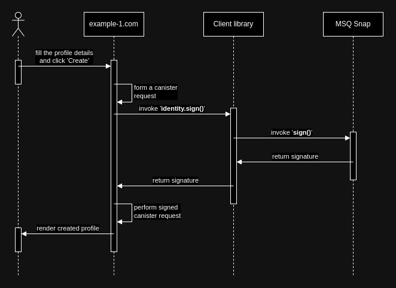

### 4.5 Mask Linking

Mask linking allows a website to migrate to another domain name, without users losing access to their data and assets. In order to execute it, the website should, using the Client library, offer its users to link their masks to a new domain, while being at the old one. Users have to explicitely approve this action.

Mask linking only works in one direction. If website A links its masks to website B, masks from B are not available at A. A website can only offer to link its own masks to another website. It is impossible to force users to link their masks from other website to the current one.

Masks linking is not transitive: if website A links its masks to website B, and website B links its masks to website C, masks from A are not available at C.

Masks can also be un-linked: if website A linked its identities to website B, A can also unlink them later.

#### 4.5.1 User Story

##### Prerequisites

1. The user has MetaMask browser extension installed.
2. The user has opened a browser tab with the website `https://example-1.com`, which is integrated with MSQ.
3. `https://example-1.com` did execute `MasqueradeClient.create()` function, which connects to the MetaMask and installs the MSQ snap if needed.
4. `https://example-1.com` recently acquired a new domain - `https://example-2.com`, which they now consider their main domain and want their users to migrate their identities to this domain.
5. Completion of user story 4.1 is optional.

##### Flow

1. The user is at `https://example-1.com` and they see a pop-up window that says that this domain is deprecated and that the user should migrate their identities to the new one, which is `https://example-2.com`.
2. The user clicks on `Migrate Now` button and a MetaMask pop-up window appears.
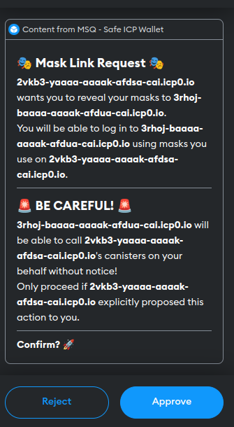
3. The user clicks on `Approve` button, the pop-up closes and the user gets redirected to `https://example-2.com`.
4. At `https://example-2.com` the user sees a familiar `Login With MetaMask` button, on which they click.
5. A new browser tab is opened, it is the login screen from `https://msq.tech`.
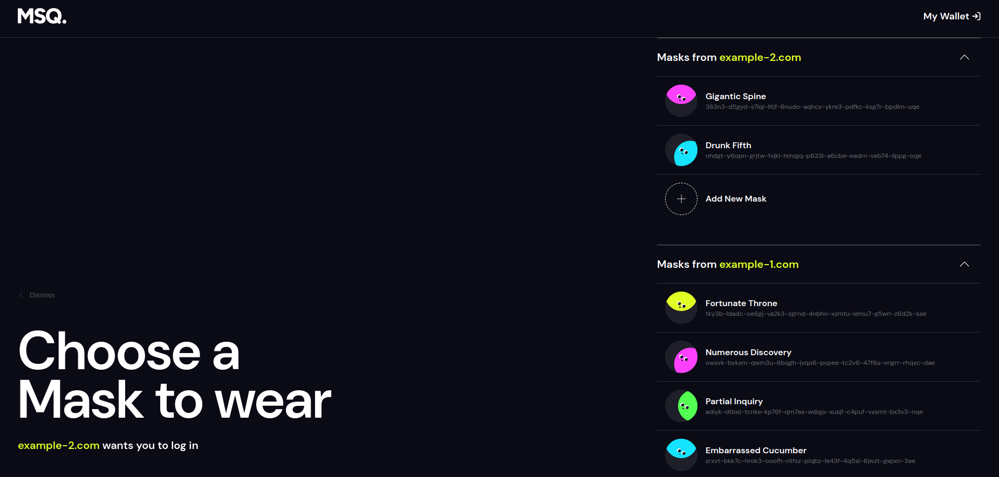
6. At this login screen the user sees not only their identities from `https://example-2.com`, but also their identities from `https://example-1.com`. They click on one of these linked identities and the login screen closes.
7. The user is back at `https://example-2.com`, but they see that now they are authorized with their identity from `https://example-1.com`.

8. `https://example-2.com` now can sign messages with the user's identity from `https://example-1.com`.

#### 4.5.2 Sequence Diagram

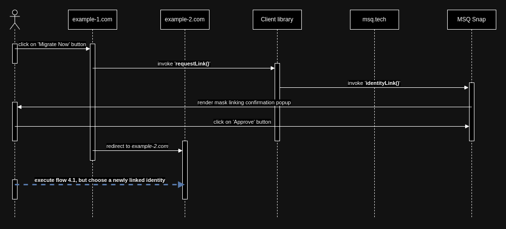